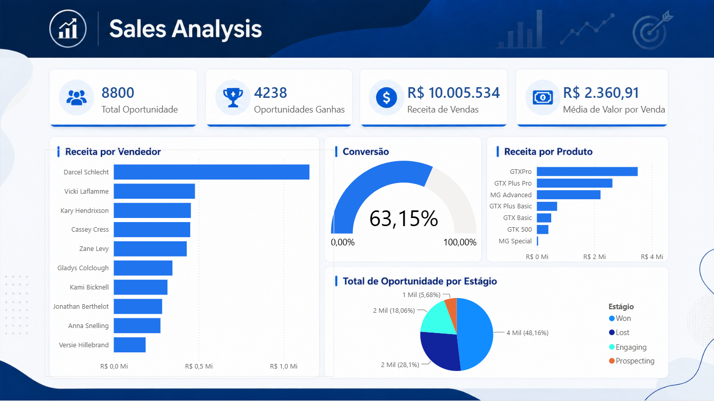
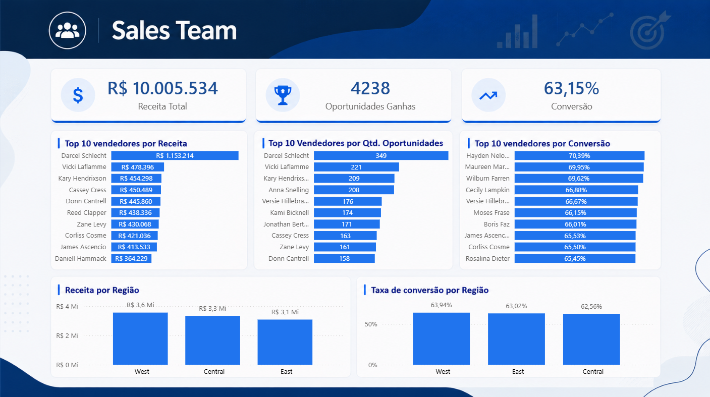
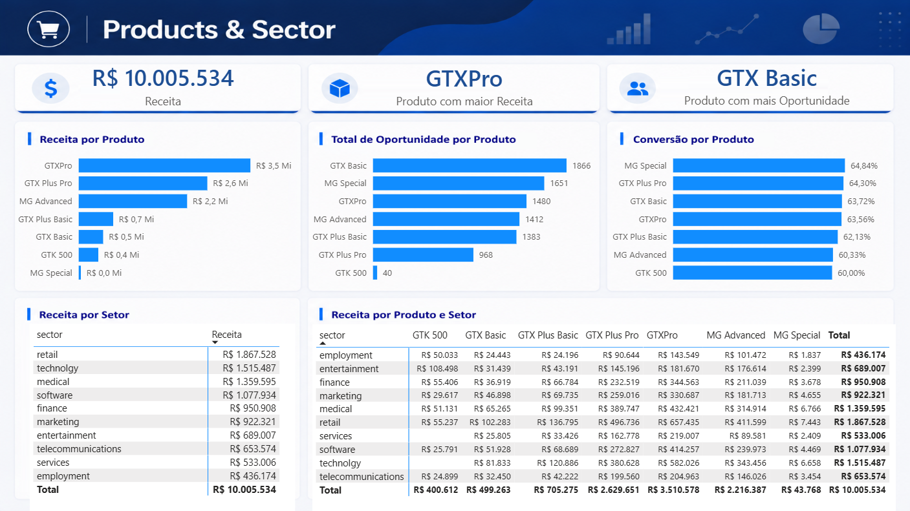
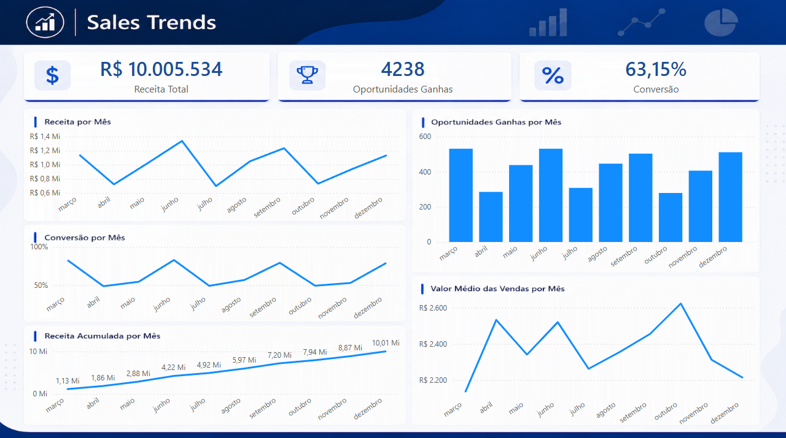

<div align="center">

# 📊 Sales Analysis

### Dashboard de Análise de Vendas com Power BI

<br>

[](https://powerbi.microsoft.com/)
[](https://learn.microsoft.com/pt-br/dax/)
[](https://learn.microsoft.com/pt-br/power-query/)

</div>

---

## 📌 Sobre o projeto

O **Sales Analysis** é um dashboard desenvolvido no **Power BI** com o objetivo de analisar o desempenho comercial de uma operação de vendas.

O projeto permite acompanhar indicadores relacionados a **receita, oportunidades, conversão, vendedores, produtos, regiões, setores e evolução das vendas ao longo do tempo**.

A solução foi desenvolvida com foco em **Business Intelligence, visualização de dados e análise de indicadores comerciais**, permitindo explorar diferentes aspectos do processo de vendas e identificar padrões de desempenho.

---

## 🎯 Objetivo

O principal objetivo do projeto é transformar dados comerciais em informações que permitam acompanhar o desempenho das vendas e responder perguntas como:

- Qual é a receita total gerada?
- Qual é o valor total das oportunidades?
- Qual é a taxa de conversão?
- Quais vendedores apresentam maior receita?
- Quais vendedores possuem maior número de oportunidades ganhas?
- Quais produtos geram mais receita?
- Quais produtos possuem maior quantidade de oportunidades?
- Como a receita está distribuída entre as regiões?
- Quais regiões apresentam maior taxa de conversão?
- Como a receita evolui ao longo dos meses?
- Como o número de oportunidades ganhas varia ao longo do tempo?
- Como a taxa de conversão evolui mensalmente?
- Qual é o valor médio das vendas?
- Como a receita acumulada evolui ao longo do período?

---

# 📊 Dashboard

O projeto é dividido em quatro páginas principais, cada uma com um objetivo específico de análise.

---

## 🏠 1. Overview

A página **Overview** apresenta uma visão geral dos principais indicadores comerciais.

### 📌 Principais indicadores

- 💼 Total de Oportunidades
- 📈 Taxa de Conversão
- 🏆 Oportunidades Ganhas
- 💰 Receita de Vendas
- 💵 Valor Médio por Venda

### 🔎 Principais análises

#### Receita por Vendedor

Permite comparar a receita gerada pelos vendedores e identificar os profissionais com maior participação no resultado comercial.

#### Receita por Produto

Apresenta a distribuição da receita entre os diferentes produtos.

#### Total de Oportunidades por Estágio

Permite visualizar como as oportunidades estão distribuídas entre os diferentes estágios do processo comercial.

---

## 👥 2. Sales Team

A página **Sales Team** é dedicada à análise do desempenho da equipe comercial.

### 📌 Principais análises

#### Top 10 Vendedores por Receita

Ranking dos vendedores com maior receita gerada.

#### Top 10 Vendedores por Oportunidades Ganhas

Permite identificar os vendedores com maior quantidade de oportunidades convertidas em vendas.

#### Receita por Região

Compara a receita gerada pelas diferentes regiões comerciais.

#### Top 10 Vendedores por Conversão

Ranking dos vendedores de acordo com sua taxa de conversão.

#### Taxa de Conversão por Região

Permite comparar o desempenho de conversão entre as regiões.

### 💡 Objetivo

Essa página busca facilitar a identificação de **vendedores e regiões com melhor desempenho comercial**, permitindo comparações entre volume, receita e conversão.

---

## 📦 3. Products & Sector

A página **Products & Sector** apresenta uma visão detalhada do desempenho dos produtos e setores atendidos pela operação comercial.

### 📌 Principais indicadores

- 💰 Receita
- 🏆 Produto com maior Receita
- 📦 Produto com maior quantidade de Oportunidades

### 🔎 Principais análises

#### Receita por Produto

Permite comparar a receita gerada por cada produto.

#### Total de Oportunidades por Produto

Apresenta a quantidade de oportunidades associadas a cada produto.

#### Conversão por Produto

Permite comparar o desempenho de conversão entre os produtos.

#### Receita por Setor

Apresenta a distribuição da receita entre os diferentes setores.

#### Receita por Setor e Produto

Permite analisar a receita de forma detalhada, cruzando:

**Setor → Produto**

Essa visão possibilita identificar quais produtos apresentam maior desempenho dentro de cada setor.

---

## 📈 4. Trends

A página **Trends** apresenta a evolução temporal dos principais indicadores comerciais.

### 📌 Indicadores analisados

- 💰 Receita Total
- 🏆 Oportunidades Ganhas
- 📊 Taxa de Conversão
- 💵 Valor Médio das Vendas
- 📈 Receita Acumulada

### 🔎 Análises temporais

#### Receita ao longo do tempo

Permite acompanhar a evolução mensal da receita.

#### Oportunidades Ganhas por mês

Apresenta a quantidade de oportunidades ganhas ao longo do período analisado.

#### Evolução da Conversão

Permite observar como a taxa de conversão varia ao longo dos meses.

#### Valor Médio das Vendas

Apresenta a evolução mensal do valor médio das vendas.

#### Receita Acumulada

Permite acompanhar o crescimento acumulado da receita ao longo do período.

---

# 📌 Principais KPIs

| KPI | Descrição |
|---|---|
| 💰 Receita | Receita total gerada pelas vendas |
| 💼 Total de Oportunidades | Quantidade/valor total de oportunidades |
| 🏆 Oportunidades Ganhas | Quantidade de oportunidades convertidas |
| 📈 Conversão | Taxa de conversão das oportunidades |
| 💵 Média de Venda | Valor médio das vendas |

---

# 🧮 Medidas e DAX

O projeto utiliza medidas em **DAX** para criação dos principais indicadores e análises.

Entre as principais medidas utilizadas estão:

- `Receita`
- `Receita Acumulada`
- `Conversão`
- `Oportunidades Ganhas`
- `Média Venda`
- `Total Oportunidade`
- `Produto Maior Receita`
- `Produto Mais Vendido`

As medidas permitem que os indicadores sejam calculados dinamicamente conforme o contexto de análise e os filtros aplicados no relatório.

---

# 🗂️ Estrutura dos dados

O projeto utiliza diferentes tabelas para organizar as informações necessárias às análises.

### Principais tabelas

- `sales_pipeline` — informações relacionadas às oportunidades e vendas
- `sales_teams` — informações relacionadas às equipes e regiões
- `accounts` — informações relacionadas aos setores
- `Calendario` — dimensão temporal utilizada nas análises de tendência

A utilização de uma tabela calendário permite realizar análises temporais e acompanhar a evolução dos indicadores ao longo dos meses.

---

# 🛠️ Tecnologias utilizadas

<div align="center">


</div>

### Ferramentas e conceitos

- Power BI
- DAX
- Power Query
- Modelagem de dados
- Medidas
- KPIs
- Visualização de dados
- Análise comercial
- Análise temporal
- Ranking
- Indicadores de conversão

---

# 🎨 Design e experiência

O dashboard foi desenvolvido buscando equilibrar **visualização, organização e facilidade de navegação**.

A interface utiliza uma identidade visual voltada para análise comercial, com organização das informações em diferentes páginas e seções.

### Principais características

- 🎨 Identidade visual própria
- 🧭 Navegação entre páginas
- 📊 Cards para indicadores
- 📈 Visualizações de tendência
- 🏆 Rankings
- 🔎 Análises por produto, vendedor e região
- 📅 Análises temporais
- 📋 Tabelas para detalhamento das informações

---

# 🖼️ Visualizações

## 🏠 Overview



---

## 👥 Sales Team



---

## 📦 Products & Sector



---

## 📈 Trends



---

# 📁 Estrutura do projeto

```text
Sales-Analysis-PowerBI/
│
├── README.md
│
├── dashboard/
│   └── Sales-Analysis.pbix
│
├── images/
│   ├── overview.png
│   ├── sales-team.png
│   ├── products-sector.png
│   └── trends.png
│
├── backgrounds/
│   ├── Overview.png
│   ├── Sales_Team.png
│   ├── Products_Sector.png
│   └── Sales_Trends.png
└── data/
    ├── accounts.csv
    ├── data_dictionary.csv
    ├── products.csv
    └── sales_pipeline.csv
    └── sales_teams.csv
